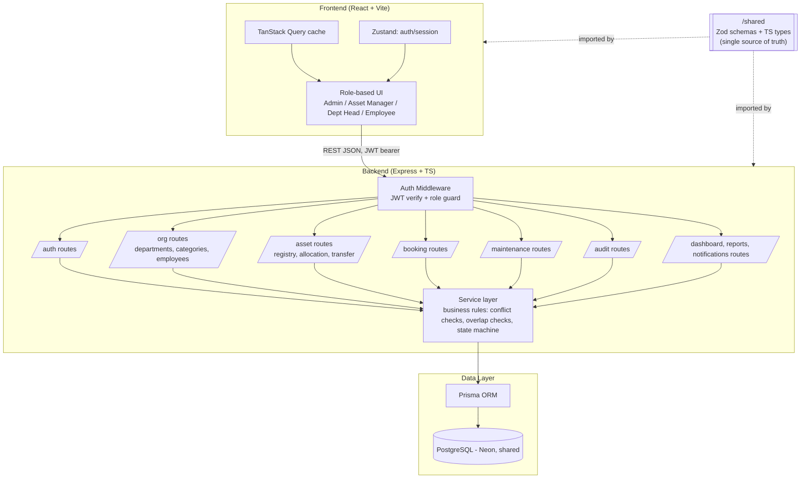

# AssetFlow — 8-Hour Hackathon Implementation Plan & Architecture

**Team size:** 2 devs, working in parallel on separate machines
**Time budget:** 8 hours, ship a working, demo-ready product
**Goal:** Clean ERP-grade architecture + working core workflows > feature-count. Judges remember polish + a couple of "wow" details, not 10 half-built screens.

---

## 0. Non-negotiable ground rules (read first, both of you)

1. **Do NOT start coding features until Phase 0 (first 30 min) is done together.** Every merge conflict and integration disaster in a 2-person hackathon comes from skipping this.
2. **The Prisma schema and the API contract are the shared contract.** Once agreed in Phase 0, changes to them require a 2-line Slack/Discord message before you touch them — everything else is yours to own freely.
3. **Use one shared cloud Postgres DB from minute 1** (Neon or Supabase, free tier). Do not develop against two different local SQLite files — you will waste hour 6 reconciling data and migrations.
4. **Commit small, commit often, push every 20-30 min.** Never let uncommitted work sit for more than an hour.
5. **Vertical split, not horizontal.** Nobody is "the backend guy" and "the frontend guy" — that creates a hard dependency chain. Instead each person owns a set of *modules* end-to-end (DB → API → UI). See Phase 2.

---

## 1. Tech Stack (optimized for speed + looks good to judges)

| Layer | Choice | Why |
|---|---|---|
| Monorepo | pnpm workspaces (`/frontend`, `/backend`, `/shared`) | one repo, one clone, shared types, no version drift |
| Backend | Node.js + Express + TypeScript | fast to write, everyone knows it, no build-step drama |
| ORM / DB | Prisma + PostgreSQL (hosted on **Neon.tech**, free, instant shareable connection string) | type-safe, migrations are trivial, both devs hit the same live DB |
| Auth | JWT (access token) + bcrypt, role stored on User row | simple, no external auth provider setup time |
| Frontend | React + Vite + TypeScript | fastest dev loop |
| Styling/UI | Tailwind CSS + shadcn/ui | pre-built accessible components → looks professional fast |
| State/data | TanStack Query (server state) + Zustand (small client state: auth user, sidebar) | avoids prop-drilling chaos with 2 people touching the tree |
| Charts | Recharts | for the KPI dashboard / reports screen (stand-out point) |
| Realtime-ish | Socket.io (stretch goal) — polling fallback with TanStack Query `refetchInterval` if time is short | notifications feel "alive" without needing sockets to be done in hour 2 |
| QR codes | `qrcode` npm package | generates QR per asset — cheap visual "wow" for judges |
| Validation | Zod, shared between frontend forms and backend request validation (via `/shared` package) | one source of truth for what a valid "Asset" or "Booking" payload looks like |
| Deployment (optional, do only if time allows in Hour 8) | Frontend → Vercel, Backend → Render/Railway, DB → Neon (already hosted) | live demo link > localhost demo |

**Why this stack specifically for a 2-person split:** Prisma schema + Zod schemas in `/shared` act as the "contract" — once it's written in Phase 0, Person A and Person B can each generate their own API routes and UI screens against it without ever needing to ask "what does your endpoint return?"

---

## 2. High-Level Architecture



### Architectural principles that will make this "stand out"

- **Service layer separation**: routes never touch Prisma directly. `routes → service → prisma`. This is the single biggest thing that makes a hackathon backend look "engineered" instead of "hacked." It also means Person A and Person B can write services independently and unit-test them without spinning up the HTTP layer.
- **State machine for Asset lifecycle**, not scattered `if` statements. One function `canTransition(currentState, nextState)` used everywhere (allocation, maintenance, audit) — enforces `Available ↔ Under Maintenance`, `Allocated → Available`, etc. from a single table of allowed transitions. Put this in `/shared` so both frontend (to grey out invalid buttons) and backend (to reject invalid transitions) use the exact same rules.
- **Role-based middleware, not role-based `if` in every route**: `requireRole(['ADMIN'])`, `requireRole(['ADMIN','ASSET_MANAGER'])` as composable Express middleware.
- **Every write action creates an ActivityLog row** (generic `logActivity(userId, action, entityType, entityId, meta)` helper called from the service layer) — this single helper powers Screen 10 (Activity Log) for free and is a nice architectural flex ("everything is audit-logged by design").
- **Notifications as a side-effect of services, not a separate manual step**: e.g. `approveMaintenanceRequest()` internally calls `createNotification()` and `logActivity()`. One place to reason about, easy to demo consistency.

---

## 3. Database Schema (Prisma) — agree on this together in Phase 0, then don't touch without a heads-up

```prisma
enum Role {
  ADMIN
  ASSET_MANAGER
  DEPARTMENT_HEAD
  EMPLOYEE
}

enum AssetStatus {
  AVAILABLE
  ALLOCATED
  RESERVED
  UNDER_MAINTENANCE
  LOST
  RETIRED
  DISPOSED
}

enum BookingStatus {
  UPCOMING
  ONGOING
  COMPLETED
  CANCELLED
}

enum MaintenanceStatus {
  PENDING
  APPROVED
  REJECTED
  TECHNICIAN_ASSIGNED
  IN_PROGRESS
  RESOLVED
}

enum TransferStatus {
  REQUESTED
  APPROVED
  REJECTED
  COMPLETED
}

enum AuditItemResult {
  PENDING
  VERIFIED
  MISSING
  DAMAGED
}

model User {
  id            String       @id @default(cuid())
  name          String
  email         String       @unique
  passwordHash  String
  role          Role         @default(EMPLOYEE)
  departmentId  String?
  department    Department?  @relation(fields: [departmentId], references: [id])
  status        String       @default("ACTIVE") // ACTIVE / INACTIVE
  createdAt     DateTime     @default(now())

  allocationsHeld   Allocation[]        @relation("HeldBy")
  bookingsMade      Booking[]
  maintenanceRaised MaintenanceRequest[]
  auditAssignments  AuditAssignment[]
  notifications     Notification[]
  activityLogs      ActivityLog[]
}

model Department {
  id        String    @id @default(cuid())
  name      String
  headId    String?
  parentId  String?
  parent    Department? @relation("DeptHierarchy", fields: [parentId], references: [id])
  children  Department[] @relation("DeptHierarchy")
  status    String    @default("ACTIVE")
  employees User[]
  assets    Asset[]
}

model AssetCategory {
  id     String  @id @default(cuid())
  name   String
  fields Json?   // e.g. { "warrantyPeriodMonths": true }
  assets Asset[]
}

model Asset {
  id               String        @id @default(cuid())
  assetTag         String        @unique // AF-0001, auto-generated
  name             String
  categoryId       String
  category         AssetCategory @relation(fields: [categoryId], references: [id])
  serialNumber     String?
  acquisitionDate  DateTime?
  acquisitionCost  Float?
  condition        String?
  location         String?
  photoUrl         String?
  isBookable       Boolean       @default(false)
  status           AssetStatus   @default(AVAILABLE)
  departmentId     String?
  department       Department?   @relation(fields: [departmentId], references: [id])
  qrCodeUrl        String?
  createdAt        DateTime      @default(now())

  allocations   Allocation[]
  transfers     Transfer[]
  bookings      Booking[]
  maintenance   MaintenanceRequest[]
  auditItems    AuditItem[]
}

model Allocation {
  id                 String    @id @default(cuid())
  assetId            String
  asset              Asset     @relation(fields: [assetId], references: [id])
  holderUserId       String?
  holder             User?     @relation("HeldBy", fields: [holderUserId], references: [id])
  holderDepartmentId String?
  allocatedAt        DateTime  @default(now())
  expectedReturnAt   DateTime?
  returnedAt         DateTime?
  conditionNoteIn    String?
  isActive           Boolean   @default(true) // false once returned/transferred
}

model Transfer {
  id           String         @id @default(cuid())
  assetId      String
  asset        Asset          @relation(fields: [assetId], references: [id])
  fromUserId   String?
  toUserId     String?
  status       TransferStatus @default(REQUESTED)
  requestedAt  DateTime       @default(now())
  decidedAt    DateTime?
  decidedById  String?
}

model Booking {
  id         String        @id @default(cuid())
  assetId    String
  asset      Asset         @relation(fields: [assetId], references: [id])
  bookedById String
  bookedBy   User          @relation(fields: [bookedById], references: [id])
  startTime  DateTime
  endTime    DateTime
  status     BookingStatus @default(UPCOMING)
  createdAt  DateTime      @default(now())
}

model MaintenanceRequest {
  id            String             @id @default(cuid())
  assetId       String
  asset         Asset              @relation(fields: [assetId], references: [id])
  raisedById    String
  raisedBy      User               @relation(fields: [raisedById], references: [id])
  issue         String
  priority      String             @default("MEDIUM")
  photoUrl      String?
  status        MaintenanceStatus  @default(PENDING)
  technicianName String?
  createdAt     DateTime           @default(now())
  resolvedAt    DateTime?
}

model AuditCycle {
  id          String       @id @default(cuid())
  scopeDept   String?
  scopeLoc    String?
  startDate   DateTime
  endDate     DateTime
  status      String       @default("OPEN") // OPEN / CLOSED
  assignments AuditAssignment[]
  items       AuditItem[]
}

model AuditAssignment {
  id           String     @id @default(cuid())
  auditCycleId String
  auditCycle   AuditCycle @relation(fields: [auditCycleId], references: [id])
  auditorId    String
  auditor      User       @relation(fields: [auditorId], references: [id])
}

model AuditItem {
  id           String          @id @default(cuid())
  auditCycleId String
  auditCycle   AuditCycle      @relation(fields: [auditCycleId], references: [id])
  assetId      String
  asset        Asset           @relation(fields: [assetId], references: [id])
  result       AuditItemResult @default(PENDING)
  note         String?
}

model Notification {
  id        String   @id @default(cuid())
  userId    String
  user      User     @relation(fields: [userId], references: [id])
  type      String   // ASSET_ASSIGNED, MAINTENANCE_APPROVED, BOOKING_REMINDER, ...
  message   String
  isRead    Boolean  @default(false)
  createdAt DateTime @default(now())
}

model ActivityLog {
  id         String   @id @default(cuid())
  userId     String
  user       User     @relation(fields: [userId], references: [id])
  action     String
  entityType String
  entityId   String
  meta       Json?
  createdAt  DateTime @default(now())
}
```

---

## 4. The Split — two independent, end-to-end vertical tracks

This is the key decision that lets you work **simultaneously without blocking each other**. Each person owns full-stack responsibility (DB tweaks if truly needed → service → route → UI) for their track. Neither track's routes/files overlap, so git merges are close to conflict-free.

### Track A — "Org, People & Visibility" (Dev 1)
- Screen 1: Login/Signup + JWT auth + role middleware
- Screen 3: Organization Setup (Departments, Categories, Employee Directory + promote to role)
- Screen 2: Dashboard/Home (KPI cards, overdue highlights, quick actions)
- Screen 10: Activity Logs & Notifications (bell icon, notification list, full log table)
- Screen 9 (half): Department-wise allocation summary + exportable CSV

**Files owned:** `backend/src/modules/auth/*`, `backend/src/modules/org/*`, `backend/src/modules/dashboard/*`, `backend/src/modules/notifications/*`, `backend/src/modules/logs/*`
`frontend/src/pages/Login`, `frontend/src/pages/Signup`, `frontend/src/pages/OrgSetup/*`, `frontend/src/pages/Dashboard`, `frontend/src/pages/Notifications`, `frontend/src/pages/ActivityLog`

### Track B — "Assets, Bookings & Operations" (Dev 2)
- Screen 4: Asset Registration & Directory (register, search/filter, QR generation, per-asset history)
- Screen 5: Asset Allocation & Transfer (conflict rule, transfer workflow, return flow, overdue flagging)
- Screen 6: Resource Booking (calendar, overlap validation, cancel/reschedule)
- Screen 7: Maintenance Management (raise, approval workflow, technician assignment)
- Screen 8: Asset Audit (create cycle, assign auditors, verify, discrepancy report, close cycle)
- Screen 9 (half): Asset utilization, maintenance frequency, booking heatmap

**Files owned:** `backend/src/modules/assets/*`, `backend/src/modules/bookings/*`, `backend/src/modules/maintenance/*`, `backend/src/modules/audits/*`
`frontend/src/pages/Assets/*`, `frontend/src/pages/Bookings`, `frontend/src/pages/Maintenance`, `frontend/src/pages/Audits`, `frontend/src/pages/Reports`

### Shared, written together in Phase 0, then frozen
- `shared/schema.prisma`
- `shared/types/*.ts` (generated Prisma types + Zod schemas)
- `shared/stateMachines/assetLifecycle.ts` (the one allowed-transitions table)
- `backend/src/middleware/auth.ts`, `backend/src/middleware/requireRole.ts`
- `frontend/src/lib/apiClient.ts` (thin fetch wrapper with base URL + auth header), `frontend/src/components/ui/*` (shadcn primitives), `frontend/src/layouts/AppShell.tsx` (sidebar/topbar nav shell both tracks plug pages into)

Because both people work inside their own module folders on both frontend and backend, **you can each run `git pull && git push` all day without ever touching the same file** except the shared ones (which are written once, early, and rarely touched again).

---

## 5. Git Workflow

```
main                — always deployable, protected, only merge via PR (or fast merge if solo-reviewing each other)
├── dev             — integration branch, both merge here first
│   ├── feat/trackA-auth-org
│   ├── feat/trackA-dashboard-notifications
│   ├── feat/trackB-assets-allocation
│   ├── feat/trackB-booking-maintenance-audit
```

**Rules:**
1. `main` and `dev` created in Phase 0 by whoever sets up the repo; both clone immediately.
2. Each person branches off `dev` per rough feature chunk (2-3 branches over the day is fine, doesn't need to be one branch per screen).
3. Push to your branch every 20-30 min minimum. Open a PR into `dev` as soon as a chunk works — don't wait till hour 6 to open your first PR.
4. Merge into `dev` early and often (every 1-1.5 hr), even if incomplete — the goal is to catch integration issues (e.g. "Dashboard expects `GET /api/assets/summary` but Track B named it `/api/assets/stats`") within the hour, not at hour 7.
5. Only merge `dev → main` when things are demo-stable — do this at least once mid-day and again before the deadline.
6. Commit message convention: `[trackA] add department CRUD routes` — makes `git log` scannable for both of you.
7. If you must touch a shared file (schema, types, middleware), message the other person first, make the change, `git push`, tell them to `git pull` before continuing — this is the only real synchronization point in the whole day.

---

## 6. API Contract (agree signatures now, build against them independently)

```
POST   /api/auth/signup                     — creates EMPLOYEE only
POST   /api/auth/login
POST   /api/auth/forgot-password
GET    /api/auth/me

GET    /api/departments        POST /api/departments        PATCH /api/departments/:id
GET    /api/categories         POST /api/categories          PATCH /api/categories/:id
GET    /api/employees          PATCH /api/employees/:id/role  (promote to DEPT_HEAD / ASSET_MANAGER)

GET    /api/dashboard/kpis
GET    /api/notifications      PATCH /api/notifications/:id/read
GET    /api/activity-logs

GET    /api/assets             POST /api/assets              GET /api/assets/:id
GET    /api/assets/:id/history
POST   /api/assets/:id/allocate
POST   /api/assets/:id/transfer-request
PATCH  /api/transfers/:id/decision
POST   /api/allocations/:id/return

GET    /api/bookings?assetId=  POST /api/bookings            PATCH /api/bookings/:id (cancel/reschedule)

GET    /api/maintenance        POST /api/maintenance          PATCH /api/maintenance/:id/decision
PATCH  /api/maintenance/:id/assign-technician
PATCH  /api/maintenance/:id/resolve

GET    /api/audits             POST /api/audits               POST /api/audits/:id/assign-auditor
PATCH  /api/audits/:id/items/:itemId   (mark verified/missing/damaged)
POST   /api/audits/:id/close

GET    /api/reports/utilization
GET    /api/reports/maintenance-frequency
GET    /api/reports/booking-heatmap
```

All list endpoints support `?status=&departmentId=&categoryId=&q=` query params. All responses: `{ data, error }` shape, consistent across both tracks.

---

## 7. Hour-by-Hour Timeline (8 hours total)

| Time | Activity |
|---|---|
| **0:00 – 0:30** | **Together.** Finalize schema above, create repo + `dev`/`main` branches, both clone. Set up Neon DB, run first `prisma migrate dev`, both confirm they can connect. Agree on API contract (section 6) and folder split (section 4). |
| **0:30 – 1:00** | **Together (fast).** Scaffold Vite + Express apps, install shared deps, set up `apiClient.ts`, `AppShell.tsx` w/ sidebar, shadcn init, JWT auth middleware skeleton, seed script with 1 admin user. Push to `dev`. |
| **1:00 – 4:00** | **Split. Track A and Track B work independently**, pushing to own branches, merging into `dev` at least once around 2:30. |
| **4:00 – 4:20** | **Quick sync (15-20 min).** Merge both branches into `dev`, run the app together, fix any contract mismatches (route names, response shapes). |
| **4:20 – 6:30** | **Split again.** Track A finishes Dashboard KPIs (now real data exists from Track B's asset/booking/maintenance modules) + notifications wiring. Track B finishes reports/heatmap + polish allocation/audit flows. Cross-module features (e.g. maintenance approval → notification → dashboard count) get wired now that both sides exist. |
| **6:30 – 7:00** | **Together.** Full merge to `main`. End-to-end click-through as Admin, Asset Manager, Dept Head, Employee — verify no broken flow. Seed realistic demo data (5-6 departments, 20+ assets, some overdue allocations, a pending audit, a couple maintenance requests at different stages). |
| **7:00 – 7:45** | **Split.** UI polish pass — empty states, loading skeletons, toasts on actions, consistent spacing, dark mode toggle if time allows. One person can also deploy (Vercel + Render + Neon) while the other polishes. |
| **7:45 – 8:00** | **Together.** README with setup + demo credentials per role, quick 2-min demo script (who logs in as what, in what order, to show off which feature), final push, breathe. |

---

## 8. What will actually make you "stand out" (given limited time, prioritize these over extra screens)

1. **The state-machine-driven asset lifecycle** with a visible status timeline on the asset detail page (small horizontal stepper showing Available → Allocated → ... with the current one highlighted) — cheap to build, reads as "these people understood the domain."
2. **Real conflict/overlap handling visibly demoed**: allocate a laptop to Priya, then try to allocate the same one to Raj live in the demo and show the blocked message + "Transfer Request" button. Same for a room double-booking. This is literally called out in the problem statement — nail it visually.
3. **One coherent role-based demo**: log in as 4 different roles in the walkthrough and show each sees a genuinely different UI (not just a hidden button) — Employee dashboard vs Admin dashboard should look meaningfully different.
4. **Dashboard with real charts** (Recharts) fed by real seeded data, not placeholder numbers.
5. **Audit discrepancy auto-generation**: mark 2 assets "Missing" in an audit cycle, close the cycle, show their status auto-flip to `Lost` and a discrepancy report appear — this workflow (rare in most teams' submissions) is a good differentiator.
6. **QR code per asset** rendered on the asset detail page — visually memorable, very cheap to add (`qrcode` npm package, ~15 min).
7. **Consistent activity log** — click into any entity and be able to say "and here's exactly who did what, when, automatically" — judges notice when a system is self-documenting.

**Cut list if you're behind schedule (in this order):** booking heatmap → maintenance frequency chart → department hierarchy (parent department nesting) → forgot-password email flow (just show a UI state) → dark mode. Do NOT cut: the allocation conflict rule, the booking overlap rule, or the maintenance/audit approval workflows — those are the core of the problem statement and what graders will specifically probe.

---

## 9. Setup Checklist (Phase 0 action items, copy-paste friendly)

```bash
# 1. Repo
mkdir assetflow && cd assetflow && git init
pnpm init -w   # or just create pnpm-workspace.yaml manually
mkdir frontend backend shared

# 2. DB
# -> create free project at https://neon.tech, copy connection string
# -> put it in backend/.env as DATABASE_URL, share the string with teammate securely (not committed)

# 3. Backend
cd backend && pnpm init && pnpm add express cors dotenv bcrypt jsonwebtoken zod @prisma/client
pnpm add -D typescript ts-node-dev prisma @types/express @types/node @types/bcrypt @types/jsonwebtoken
npx prisma init
# paste schema, then:
npx prisma migrate dev --name init

# 4. Frontend
cd ../frontend
pnpm create vite . --template react-ts
pnpm add @tanstack/react-query zustand react-router-dom recharts qrcode axios zod
pnpm dlx shadcn@latest init

# 5. Both push initial scaffold to `dev` before splitting up
git checkout -b dev
git add . && git commit -m "chore: initial scaffold, schema, auth skeleton"
git remote add origin <repo-url>
git push -u origin dev
```

Both teammates then `git clone`, `pnpm install`, add their own `.env` with the shared `DATABASE_URL`, and start on their track branch.

---

## 10. Definition of Done for the demo

- [ ] Signup → creates Employee only; Admin promotes to Dept Head / Asset Manager from Employee Directory
- [ ] Admin sets up ≥3 departments, ≥3 categories
- [ ] Asset Manager registers ≥15 assets across categories, some marked bookable
- [ ] Double-allocation is blocked and offers Transfer Request; transfer approval re-allocates and updates history
- [ ] Two overlapping booking requests: first succeeds, second is rejected with a clear message
- [ ] Maintenance request goes Pending → Approved (asset flips to Under Maintenance) → Resolved (asset flips back to Available)
- [ ] Audit cycle created, auditor assigned, items marked Verified/Missing/Damaged, cycle closed, missing item auto-flips to Lost, discrepancy report visible
- [ ] Dashboard KPIs and overdue-return/overdue-booking highlighting reflect real data
- [ ] Notifications feed shows at least 5 distinct notification types generated by real actions
- [ ] Activity log shows a real trail of actions across at least 3 different users/roles
